# AsProgrammer dregmod

AsProgrammer dregmod allow you to program flash memory on the protocols spi, I2C, MicroWire. Supports Buzzpirat, Bus Pirate, CH341a, UsbAsp, AVRISP(LUFA), Arduino & FT232H

http://dangerousprototypes.com/forum/index.php?topic=10698.0

**WARNING**: While the Bus Pirate part is operational, the GUI part of the AS Programmer remains frozen; this is normal. Refer to the debug console and be patient... I will be enhancing this mod over time (integration included). If buzzpirat console freezes(~2 mins without output)/crash : close this program, reconnect USB port and try again

**WARNING**: Virtual Machines (VM) and/or USB Hubs can cause problems. It is advisable to ALWAYS use a native OS, and connect the Bus Pirate directly to a USB port

**WARNING**: I recommend using a speed of approximately 100kHz for each protocol as the maximum, since the quality of the cables is important and I do not trust that the length of yours is short, especially if there is an adapter to clips, etc. The longer the cable and the more adapters there are, coupled with lower voltage, the more you will need to use a lower speed

**WARNING**: USE SHORT HIGH-QUALITY USB CABLE

**WARNING**: Some firmwares have a bug in the binary SPI mode (like the latest community firmware). To make it work, you should select the checkbox: Buzzpirat Menu -> Fix SPI Firmware Bug.

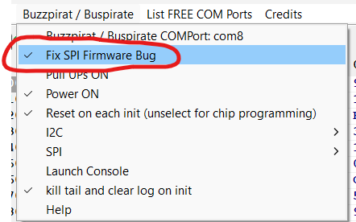 

# Best Firmware

**I recommend using the latest Buzzpirat firmware for the Bus Pirate v3:** https://buzzpirat.com/docs/firmware-update/

# Download
https://github.com/therealdreg/asprogrammer-dregmod/releases

# WARNING
Only issues and/or PRs related to the buzzpirat & bus pirate function are accepted. If you encounter any other kind of problem, please check if the same issue occurs with the official UsbAsp-flash and report it there:

- https://github.com/nofeletru/UsbAsp-flash/issues
- https://github.com/nofeletru/UsbAsp-flash/discussions

---

# Example reading & writing microchip at24c256 i2c eeprom 5v

## 1. Connect Buzzpirat to at24c256 chip

Connect the 5V from the Buzzpirat to both VCC and VPU

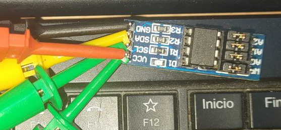

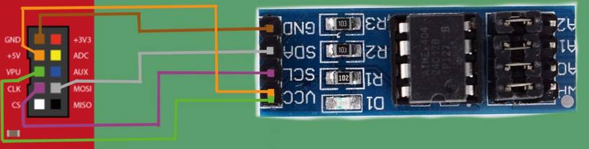

(THX TO David Sanchez & Mecanico for images)

## 2. Click on Buzzpirat menu -> COM Port, Select Pull UPs ON

Check the available COM ports by clicking on the "List Free COM Ports" menu

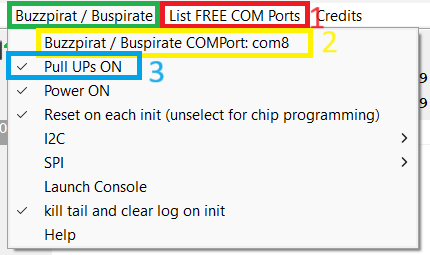

## 3. Click on IC menu -> I2C -> _24Cxxx -> _24C256

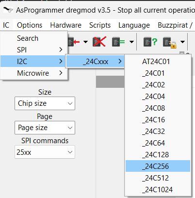

## 4. Press the "Read IC" button and wait patiently (the GUI will become unresponsive)

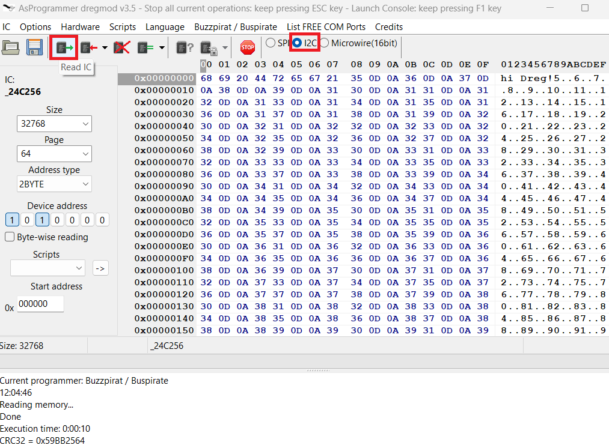

## 5. I2C Scanner: Click on Buzzpirat Menu -> I2C -> Just I2C Scanner

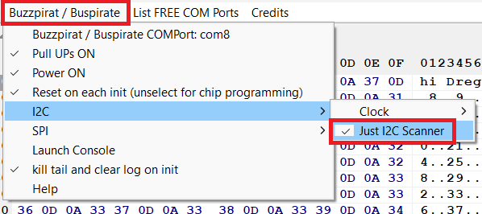

If nothing appears here, you have connected something incorrectly

## 6. Press the "Read IC" button and wait patiently (the GUI will become unresponsive)

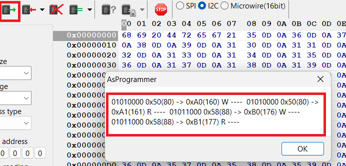

---

# Example reading & writing winbond 25q64 3v3 spi flash

## 1. Connect Buzzpirat to at24c256 chip

Connect the 3V3 from the Buzpirat to VCC 

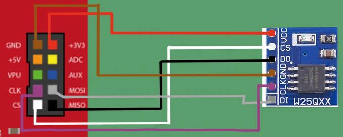

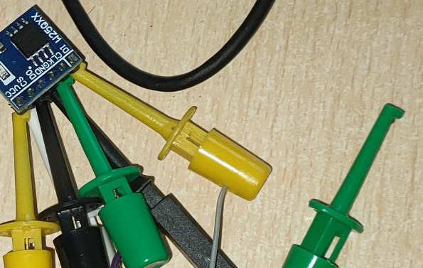

(THX TO David Sanchez & Mecanico for images)

## 2. Click on SPI radio button

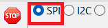

## 3. Click on Read ID (wait patiently, the GUI will become unresponsive) and select W25Q64BV

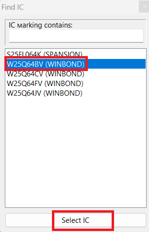

If nothing appears here, you have connected something incorrectly

## 4. Press the "Read IC" button and wait patiently (~30 mins) (the GUI will become unresponsive)

---

# Example reading & writing winbond W25Q64FW 1.8v spi flash

**WARNING**: Don't connect +3v3 or +5V to WINBOND CHIP.

Follow the same steps as in the previous chapter for the 3.3v Windbond, but Connect the Winbond's VCC & Bus Pirate's VPU to an external 1.8v power source (all GNDs together):

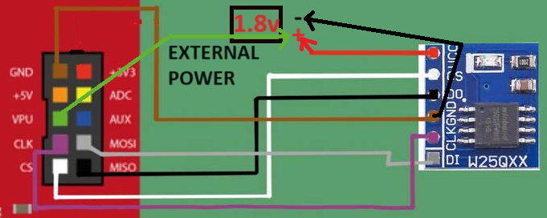

Change the following in the configuration:
- Activate pull-ups of the Bus Pirate
- SPI Output: Open-drain
- SPI Speed: 30kHz

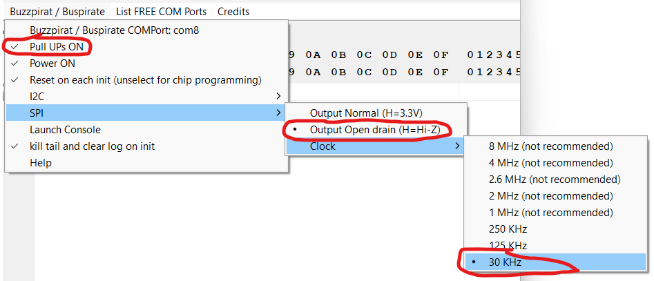

Select W25Q64FW 1.8v when found

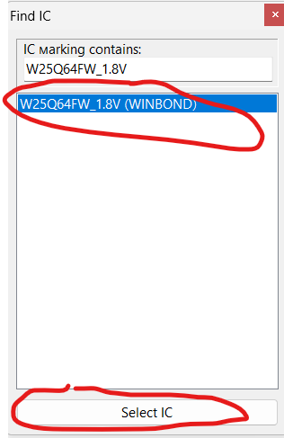

Press "Read IC" button and wait patiently (~40 mins) (the GUI will become unresponsive)

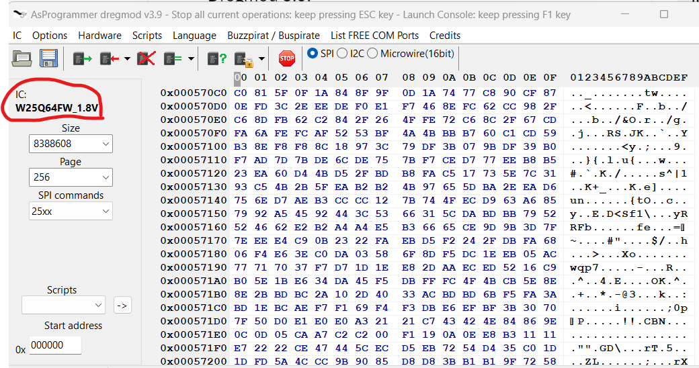

---

# How to build & debug

Instructions tested for Windows 11

**WARNING:** Reading flash content in debug mode .exe can cause exceptions! Please use a Release .exe version and run it outside of the Lazarus IDE

**WARNING:** Caution when editing a FORM if you or the Lazarus IDE is altering a caption in main.lfm as it will disrupt the translation system. I prefer to manually edit the .lfm files to avoid this kind of issue

## 1. download & Install lazarus 32 bits

https://www.lazarus-ide.org/

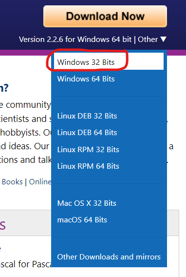

## 2. clone this repo

git clone https://github.com/therealdreg/asprogrammer-dregmod.git

## 3. extract mphexeditor.zip to root project folder

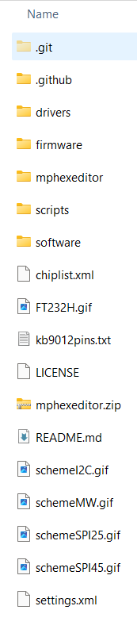

## 4. Copy chiplist.xml to software/ directory

## 5. Open AsProgrammer.lpi with lazarus

Just ignore hexeditor errors/warnings

## 6. Install mphexeditor

Go to Package menu --> Open package file (.lpk)

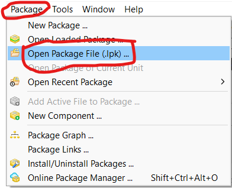

Select file:

asprogrammer-dregmod\mphexeditor\mphexeditor\src\mphexeditorlaz.lpk

Go to Use menu -> Install

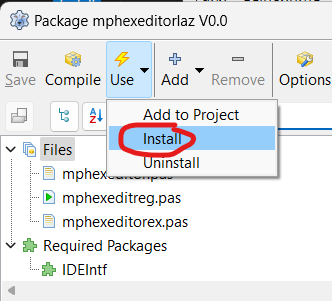

Click yes and wait....

## 7. Change build mode to debug

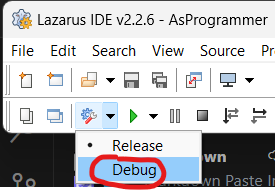

## 8. Press F9 key to run & select Enable Dwarf 3

Done!

## 9. How to rebuild all (ex: after a Menu Form change)

Go to Run menu -> Clean up and Build...

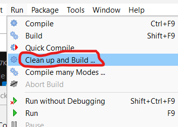

And just click on Clean up and Build button

## 10. Compile & Debug buzzpirathlp.dll

**First and foremost, close the Lazarus IDE and all instances of ASPROGRAMMER.EXE**

Download & install visual studio 2019 community edition:

https://visualstudio.microsoft.com/es/vs/older-downloads/

## 11. Compile x86 debug version

Open: asprogrammer-dregmod\software\buzzpirathlp\buzzpirathlp.sln

Select Debug version and x86:

Go to Build menu -> Rebuild solution

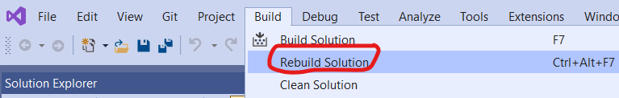

## 12. Compile a Release version of asprogrammer in the Lazarus IDE

## 13. Open the release version of ASProgrammer outside of the Lazarus IDE

## 14. Attach to AsProgrammer.exe from Visual Studio 2019

From VS 2019

Go to Debug menu -> Attach to Process..

Select ASprogrammer.exe and click to Attach button 

And done! You can debug a native C/C++ DLL in a FreePascal Lazarus .EXE Project from Visual Studio 2019

Just insert a:

__debugbreak();

in your DLL code to initiate debugging from the desired point

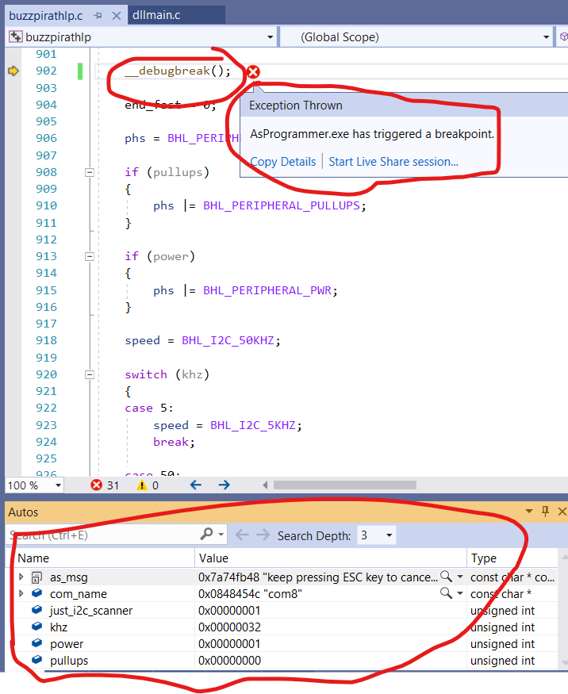

# Credits

- nofeletru for ASprogrammer: https://github.com/nofeletru/UsbAsp-flash

# Related

- https://github.com/therealdreg/flashrom_build_windows_x64
- https://github.com/therealdreg/flashrom-dregmod
- https://github.com/therealdreg/buzzpirat
