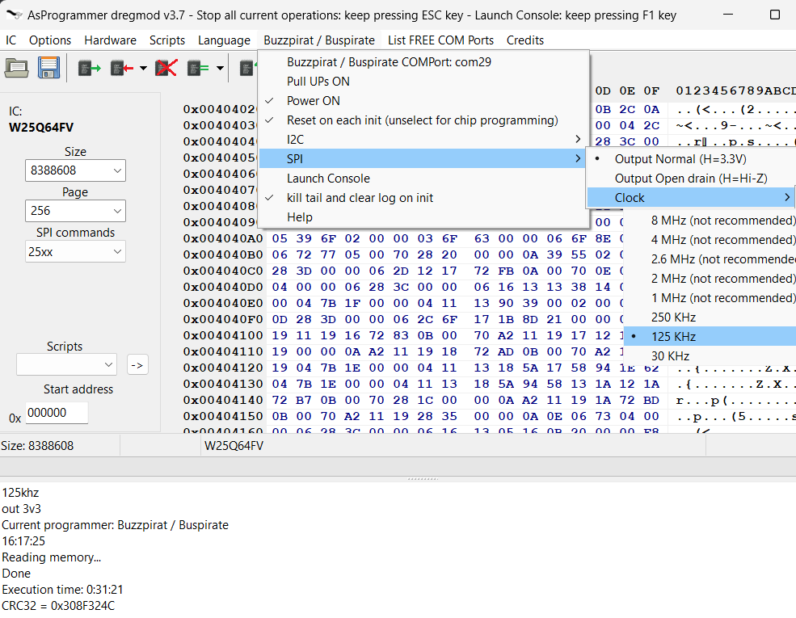

# AsProgrammer dregmod

AsProgrammer dregmod allow you to program flash memory on the protocols spi, I2C, MicroWire. Supports Buzzpirat, Bus Pirate, CH341a, UsbAsp, AVRISP(LUFA), Arduino & FT232H

# Download
https://github.com/therealdreg/asprogrammer-dregmod/releases

# WARNING
Only issues and/or PRs related to the buzzpirat & bus pirate function are accepted. If you encounter any other kind of problem, please check if the same issue occurs with the official UsbAsp-flash and report it there:

- https://github.com/nofeletru/UsbAsp-flash/issues
- https://github.com/nofeletru/UsbAsp-flash/discussions

# How to build & debug

Instructions tested for Windows 11

**WARNING:** Reading flash content in debug mode .exe can cause exceptions! Please use a Release .exe version and run it outside of the Lazarus IDE

**WARNING:** Caution when editing a FORM if you or the Lazarus IDE is altering a caption in main.lfm as it will disrupt the translation system. I prefer to manually edit the .lfm files to avoid this kind of issue

## 1. download & Install lazarus 32 bits

https://www.lazarus-ide.org/

## 2. clone this repo

git clone https://github.com/therealdreg/asprogrammer-dregmod.git

## 3. extract mphexeditor.zip to root project folder

## 4. Copy chiplist.xml to software/ directory

## 5. Open AsProgrammer.lpi with lazarus

Just ignore hexeditor errors/warnings

## 6. Install mphexeditor

Go to Package menu --> Open package file (.lpk)

Select file:

asprogrammer-dregmod\mphexeditor\mphexeditor\src\mphexeditorlaz.lpk

Go to Use menu -> Install

Click yes and wait....

## 7. Change build mode to debug

## 8. Press F9 key to run & select Enable Dwarf 3

Done!

## 9. How to rebuild all (ex: after a Menu Form change)

Go to Run menu -> Clean up and Build...

And just click on Clean up and Build button

## 10. Compile & Debug buzzpirathlp.dll

**First and foremost, close the Lazarus IDE and all instances of ASPROGRAMMER.EXE**

Download & install visual studio 2019 community edition:

https://visualstudio.microsoft.com/es/vs/older-downloads/

## 11. Compile x86 debug version

Open: asprogrammer-dregmod\software\buzzpirathlp\buzzpirathlp.sln

Select Debug version and x86:

Go to Build menu -> Rebuild solution

## 12. Compile a Release version of asprogrammer in the Lazarus IDE

## 13. Open the release version of ASProgrammer outside of the Lazarus IDE

## 14. Attach to AsProgrammer.exe from Visual Studio 2019

From VS 2019

Go to Debug menu -> Attach to Process..

Select ASprogrammer.exe and click to Attach button 

And done! You can debug a native C/C++ DLL in a FreePascal Lazarus .EXE Project from Visual Studio 2019

Just insert a:

__debugbreak();

in your DLL code to initiate debugging from the desired point

# Credits

- nofeletru for ASprogrammer: https://github.com/nofeletru/UsbAsp-flash/